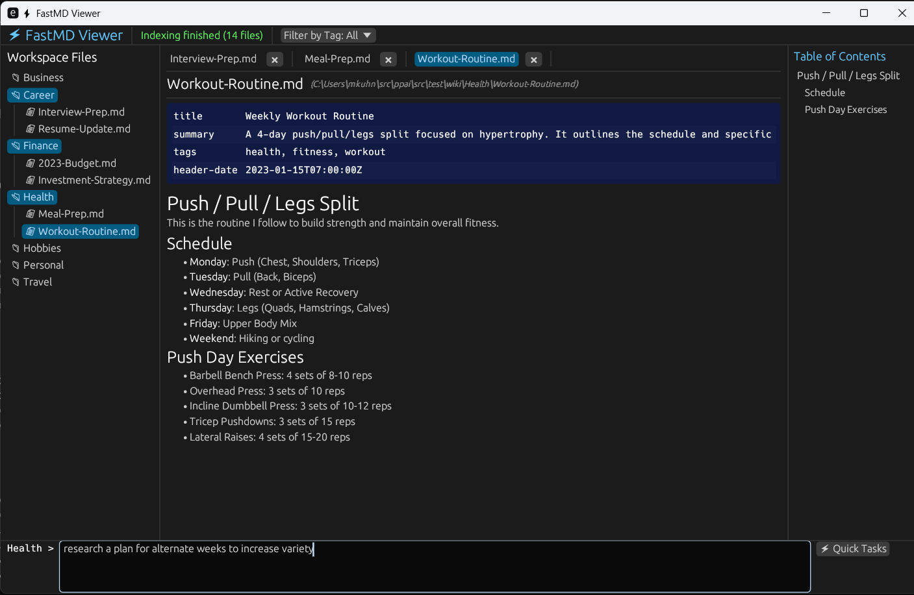

# Personal productivity AI

## Goal

Increase my personal productivity with AI without compromising security or privacy

## Solution approach

AI tools are only as powerful as the data they have to work with. I've lived a digital lifestyle for over 15 years, with anything I receive on paper going into searchable PDFs, personal notes taken with OneNote, my schedule lives on Google's calendar, and of course I get a lot of e-mail and I take several thousand pictures every year.

The solution centers around a *markdown document library*. The more information this library contains about you and your history, the more useful AI as a tool is going to be. Information gets into the library by either writing it (although editing markdown is not a focus as of now), or by _distilling_ it from other sources. I've made a habit of creating permanent notes for my AI chat queries when it seems worthwhile. Everything builds on everything else to provide a rich context.

Until it becomes every hard fact there is to know about you, which is not something you want on someone else's server. Because the internet derives revenue from advertising, it's their business to know about you. That's just how the world works, and how we have 'free' services.

This is what it looks like

## Tools

The system has access to
- Contacts (via DAV)
- Calendar (via DAV)
- E-mail (via JMAP)
- Web fetch
- Web search (with additional configuration)
- Weather
- Local markdown file grep and edits

There is no bash / no system access.

## Use cases

- Find trends in your electricity use
- Find places to hike or go to where the weather is nice
- Find all the items you ever bought from Newegg
- Create a summary document of your medical history (from available evidence)
- Investigate today's job alerts sent via e-mail and compare against my resume

## Notes

This is the age of vibe coding. This isn't inherently innovative or unique, it's software just the way I want it with exactly the feature set I need.

I am not a rust developer. I like the idea of a single, high-performance binary that's easy to deploy. I am also a software engineer, and this was a good opportunity to gain experience with another ecosystem. And I am impressed by the breadth and quality of the libraries available.

The majority of the code was written by Google's _Gemini 3.1 Pro_ model. It's good at writing correct code, but you get a lot of hidden bugs and it essentially writes legacy code that's hard to test and maintain.