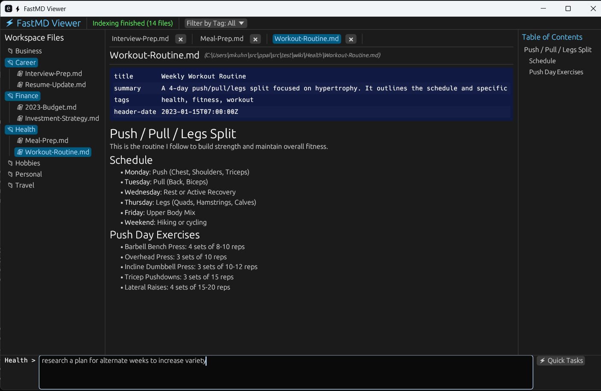

# Personal productivity AI

## Goal

Increase my personal productivity with AI without compromising security or privacy

## Vision

AI centric notes collection, supported by integration with everyday systems such as email, calendar, contacts, todo lists and web search.

## Solution approach

AI tools are only as powerful as the data they have to work with. I've lived a digital lifestyle for over 15 years, with anything I receive on paper going into searchable PDFs, personal notes taken with OneNote, my schedule lives on Google's calendar, and of course I get a lot of e-mail and I take several thousand pictures every year.

The solution centers around a *markdown document library*. The more information this library contains about you and your history, the more useful AI as a tool is going to be. Information gets into the library by either writing it, or by _distilling_ it from other sources. Everything builds on everything else to provide a rich context.

All of this in a fast, single binary, with beautifully rendered markdown.

## Tools

The system has access to
- Contacts (via DAV)
- Calendar (via DAV)
- E-mail (via JMAP)
- Web fetch
- Web search (with additional configuration)
- Weather
- Local markdown file grep and edits

There is no bash / no system access.

## Use cases

- Find trends in my electricity use
- Find places to hike or go to where the weather is nice
- Find all the items ever bought from some retailer
- Create a summary document of your medical history
- Investigate today's job alerts sent via e-mail and compare against my resume

## What it's not

I don't mind writing _raw_ markdown, and I didn't like the WYSIWYG editing experience a certain famous product provides. So this doesn't have any of this, there is a simple text editor, or you can launch any external tool.

It does not concern itself how you access or run an LLM. AI functions need an OpenAI compatible endpoint.

## Notes

I didn't start out as a rust developer. I use this daily, and it's also a research project to dive into a different ecosystem, and to manage a large codebase with 0% human hands-on coding. Rust is great! You are in good hands.
