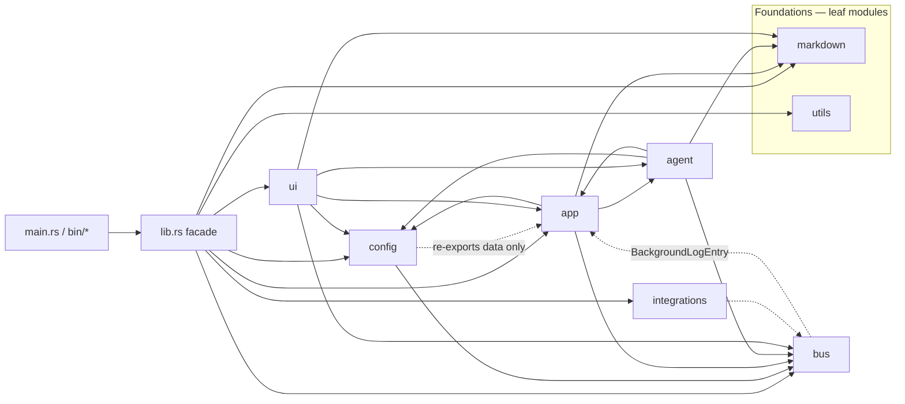

# `src/desktop` — Module Boundaries, Contract Seams, and Architecture Critique

Scope: the `fastmd` Rust crate (desktop app + `deploy` binary).
Inputs reviewed: `src/desktop/src/**` (213 .rs files), `src/desktop/AGENTS.md`,
`doc/technical-context/ARCHITECTURE_C4.md`, and the live import graph
(`rg '^use crate::'`).
Quality gate as observed: `cargo check`, `cargo clippy -- -D warnings`,
`cargo fmt --check` all pass clean; `cargo doc --no-deps --quiet` surfaces
**one** broken intra-doc link (see §6 finding 4).

---

## 1. Subsystem inventory

The crate declares **eight first-class subsystems** in `lib.rs` and one
facade re-export. Each owns a cohesive concern and is the single import
point for a class of behaviour.

| Subsystem            | Public surface (re-exports)                                                                                                  | Knows about                                                                  | Lines (`*.rs`, sum) | Files |
|----------------------|------------------------------------------------------------------------------------------------------------------------------|------------------------------------------------------------------------------|---------------------|-------|
| `bus`                | `Bus<T>`, `BusReader<T>`, `ConfigArrived`, `FileEvent*`, `BackgroundEvent`, `AgentEvent`, `FsEvent`, `ProcessEvent`, `McpAuthEvent`, `TokenUsageInfo`, `BusRouter`, `config_bus` | `app::background::BackgroundLogEntry` (one payload lives in `app/`)           | ~1.2 k              | 11    |
| `config`             | `AppConfig`, `LlmConfig`, `JmapClient`, `CalDavClient`, `CardDavClient`, `ContentLibrary`, `load_config`, `get_config_path`  | `app::vfs` (re-export only — data types, no behaviour)                      | ~1.6 k              | 2     |
| `markdown`           | `Document`, `FrontMatter`, `parse_front_matter`, `apply_task_toggle`, `InlineElem`, `RenderEvent`, `TextStyle`, `ToCEntry`, `build_toc`, `parse_markdown_to_events`, `parse_yaml_to_pairs`, `render_markdown_to_html`, `table_width::*` | nothing (leaf)                                                               | ~2.0 k              | 6     |
| `utils`              | `read_text_file`, `has_pdf_backing`, `extract_tags_from_file`, `encoding`, `path`, `tags`                                   | nothing (leaf, domain-free helpers)                                          | small               | 4     |
| `app`                | managers (`TabManager`, `SelectionManager`, `DialogManager`, `PanelLayout`, `TagManager`, `TextBuffer`, `Cursor`, `Selection`, `UndoStack`), `PersistedUiState`, `VirtualPath`, `VirtualPathError`, VFS behaviour, watcher, background, batch, browser, print, document, orchestrator, `background_task::Task` | `agent` (via `orchestrator`/`AgentSessionManager`), `bus`, `config`, `markdown` (in `text_buffer`) | ~12 k               | 40+   |
| `agent`              | `AgentContext`, `AgentSessionManager`, `run_agent` via `agent_impl::*`, `ToolContext`, `ToolManager`, every tool family     | `app::browser::BrowserSession`, `app::vfs`, `app::watcher::pdf_backing_tracker`, `bus`, `config`, `markdown` | ~25 k               | 60+   |
| `ui`                 | `FastMdApp`, `TreeNode`, `render_markdown`, `build_toc`, tree helpers, `open_in_system_editor`, `show_in_file_explorer`, `ToCEntry` re-export | `app` (every panel), `agent` (only via `AppOrchestrator`), `bus`, `config`, `markdown` | ~12 k               | 50+   |
| `integrations`       | `discord::*`                                                                                                                 | self-contained (`reqwest`, `tokio`, `serenity`-like APIs) — currently a sibling without explicit wiring in `lib.rs`/`main.rs` | ~3.5 k              | 8     |

**Facade (`lib.rs`)** — three root re-exports only:
`fastmd::mcp` (test consumer), `fastmd::ConfigArrived`, `fastmd::FastMdApp`.
Every other type is reached through its subsystem path.

**Binaries:** `main.rs` (entry, calls `eframe::run_native`),
`bin/check.rs`, `bin/deploy.rs`, plus the `deploy` module.

**Observation:** `batch` is exposed at the crate root via a re-export shim
(`src/batch/mod.rs → pub use crate::app::batch`). The implementation lives
under `app/batch`. This is a legacy relocation shim — see §6.

---

## 2. Module boundary map

The arrow `A → B` means "A imports names from B at the source level."

### Real edges observed in source

- `ui → app`: every panel, every modal, the tree, the editor, the tools
  dialog (`rg '^use crate::app::' src/ui | wc -l` → 24 distinct import
  lines). **Expected** (UI is the adapter over `app`).
- `ui → agent`: only via `AppOrchestrator` (one line in `ui/app/init.rs`,
  one in `ui/app/mod.rs`). **OK** — `ui` owns the `eframe::App` impl
  and pulls in `agent` through the orchestrator.
- `app → agent`: `app/orchestrator.rs:1 use crate::agent::AgentSessionManager`.
  This is the only `app → agent` edge.
- `agent → app`: `agent/{manager,context}.rs`, `agent/tools/context.rs`,
  `agent/tools/browser_tests.rs`, `agent/tools/manager/tests.rs` all
  `use crate::app::browser::BrowserSession`; tools also `use
  crate::app::vfs::*` and `use crate::app::watcher::pdf_backing_tracker`.
  **This is the smell — see §3.**
- `bus → app`: a single edge in `bus/events/typed.rs:17` (`use
  crate::app::background::BackgroundLogEntry`) used to type
  `ProcessEvent::LogEntry(BackgroundLogEntry)`. **Concrete architectural
  inversion — see §3.**
- `config → app`: `config.rs:17 pub use crate::app::vfs::{...}`. This is
  a re-export of VFS *types* for backwards compat only (per the
  AGENTS.md rule); no behaviour. **OK**, but ideally cleaned up — see §6.
- `app` is egui-free: `rg -n 'use eframe::egui|use egui::|^use crate::ui::'
  src/app` returns **zero matches**. The AGENTS.md rule holds.
- `app → markdown` is allowed: `app/text_buffer.rs` uses
  `DocumentContent` which delegates to `utils::markdown::parse_front_matter`
  (and that helper lives in `utils/`, not `markdown/`, which is a separate
  smell — see §6 finding 5).

---

## 3. Contract seams

A **contract seam** is a pair (or set) of types whose only purpose is to
let two modules talk to each other across a boundary. Good seams are
narrow, documented, and one-way; bad seams are wide, bidirectional, and
implicit.

| Seam                                              | Producer                  | Consumer(s)                                            | Mechanism                                  | Verdict |
|---------------------------------------------------|---------------------------|--------------------------------------------------------|--------------------------------------------|---------|
| `Bus<FileEvent>`                                  | watcher, indexer, dialogs, tool executor | `DirectoryTracker`, `FileEventProcessor`, `Indexer`, `BusRouter` | `tokio::sync::broadcast(8192)` via `bus::core` | ✅ Canonical, one-direction producer→consumer. |
| `Bus<ConfigArrived>`                              | `main()`                  | `Task` (background), `AgentSessionManager`, `FastMdApp` | broadcast + 100 ms `CONFIG_ARRIVAL_TIMEOUT` fallback | ✅ Single startup event, lazy init. |
| `mpsc::Sender<BackgroundEvent>`                   | every worker, agent thread, MCP auth flow | `FastMdApp` UI loop, dispatched by domain | `std::sync::mpsc::channel`                 | ✅ Single MPSC UI drain — the C4 doc calls this out as deliberate. |
| `Tool::execute(&ToolContext, ...)`                | LLM agent loop            | each tool implementation                               | trait + `&ToolContext { config, file_event_bus }` | ✅ Tiny context, side-effect bounded. |
| `Tool::safety()` → `Safety::{ReadOnly,Mutating}`  | tool impls                | `ToolExecutor` for parallel dispatch                   | default `Mutating`                         | ✅ Good default; opt-in concurrency. |
| `VirtualPath` / `resolve` / `resolve_writable`    | `app::vfs`                | every mutating tool (`filesystem.rs`, `yaml_header.rs`, `vfs_resolver.rs`) | pure function → `Option<(PathBuf, bool)>`  | ✅ Pure, testable, traversal-safe. |
| `AppOrchestrator`                                 | composition root          | `ui::app` (owns one), `ui::app::tests`                  | `pub` struct, all fields `pub`            | ⚠️ **Smell** — see §4. |
| `BackgroundLogEntry` (payload)                    | workers → `app/background/models.rs` | wrapped in `ProcessEvent::LogEntry` in `bus/events/typed.rs` | type re-used across the boundary | ❌ **Inversion** — `bus` depends on `app` to define a payload type. |
| `BrowserSession` (DI)                             | `app::browser`            | `agent::manager`, `agent::context`, `agent::tools::context` | `Arc<BrowserSession>` parameter            | ❌ **Layering inversion** — see §4. |
| `PdfBackingTracker` (DI)                          | `app::watcher`            | `agent::manager` (passed to `ToolExecutor`)            | `Arc<PdfBackingTracker>` parameter         | ❌ **Layering inversion** — see §4. |
| `notify::RecommendedWatcher` (handle slot)        | file-watcher thread       | `Task` exposes `take_finished_watcher`; `AppOrchestrator._watcher` | `Arc<Mutex<Option<…>>>` slot               | ⚠️ Works around `notify` not being `Clone`; a small ad-hoc contract. |

### Notable observations on the seams

1. **The `BackgroundEvent` mpsc is the only message route into the UI.**
   That is a strong invariant: a reader of `app/orchestrator.rs`
   can trust `drain_background_channel` as the one funnel. ✅
2. **The `FileEvent` bus is the only fan-out for FS state.** Every
   subsystem that cares about the FS subscribes (`DirectoryTracker`,
   `FileEventProcessor`, `Indexer`, `BusRouter`, and the orchestrator
   itself for tree rebuilds). ✅
3. **`ToolContext` is genuinely small** — just `config` and
   `file_event_bus`. Tools cannot reach the orchestrator, the agents,
   or the UI directly. ✅
4. **`AppOrchestrator` is the composition root for non-UI state** — but
   it has **23 `pub` fields and zero methods that guard invariants**
   (`app/orchestrator.rs:16-40`). Every panel reads and mutates it
   directly through `&mut self.orchestrator` plus a hand-rolled
   `pub` accessor. That is a structural seam, not a behavioural one —
   see §4.
5. **`ConfigArrived` is the only `Bus<T>`-typed seam that crosses into
   the agent.** `AgentSessionManager` subscribes and exposes a
   `drain_config` path on the UI frame. ✅ Good, but see §5 finding 2
   for an opportunity to generalise.
6. **There is no `Shutdown`/`Stop` message type.** Cancellation uses
   `AtomicBool` flags (`Task::cancel`, `AgentSessionManager::cancel_flag`)
   that are polled inside the worker threads. This is correct but
   inconsistent: `Task` exposes the flag through a method, the agent
   through `Option<Arc<AtomicBool>>` that is `take()`n at start.

---

## 4. Critique

### 4.1 The two architectural inversions (most important)

**Inversion A — `bus` depends on `app`.** The only reason
`bus::events::typed` knows about `crate::app::background::BackgroundLogEntry`
is that one variant of `ProcessEvent` carries a `BackgroundLogEntry` value.
The layering says: `bus` is the transport, `app` is the producer. So
`bus` *should not* import from `app`. The AGENTS.md already documents the
escape hatch:

> Cross-cutting value types with no single home (e.g. `TokenUsageInfo`)
> live in `bus::events::messages` (value-type home).

`BackgroundLogEntry` is exactly such a cross-cutting value type. The fix
is mechanical: move it (or wrap it) into `bus::events::messages` (or a
new `bus::events::process.rs`).

**Inversion B — `agent` and `app` are mutually dependent.** This is the
real layering problem.

- `app/orchestrator.rs` uses `agent::AgentSessionManager` to wire the
  composition root.
- `agent/manager.rs`, `agent/context.rs`, `agent/tools/context.rs` all
  depend on `app::browser::BrowserSession`.
- `agent/tools/context.rs` and `agent/tools/builtin/fs.rs` depend on
  `app::vfs::*`.
- `agent/manager.rs` takes an `Arc<PdfBackingTracker>` from
  `app::watcher`.

Rust's module system lets this compile (single crate, no cycle in
`rustc`'s sense), but **logically** it is a cycle. The mental model
"app is egui-free, agent is the LLM loop, app owns the file plumbing"
breaks: every agent-touching change has to touch both. The
`agent/tools/browser_tests.rs` file even re-imports `BrowserSession`
just to build a fake — that is a hint that `BrowserSession` wants to
live somewhere more neutral.

The fix is also mechanical and is the same move in both directions:

- Move `BrowserSession` and `PdfBackingTracker` to a new
  `app::session` (or `app::runtime`) module that **neither** `agent`
  nor `ui` owns — it becomes shared infrastructure, with the data
  types and behaviour in one place, and both `app::orchestrator` and
  `agent::manager` depend on it.
- After that move, `agent ↔ app` collapses to a single
  `app::orchestrator → agent` edge (the composition root), which is
  the correct one-way dependency.

### 4.2 `AppOrchestrator` is a god-object composition root with `pub` fields

23 `pub` fields, no accessors, no `Debug`, no `Default`, all state
visible (`app/orchestrator.rs:16-40`). The reason is historical: it is
a "view of every cross-cutting state object" so that
`ui::panels::*` can reach into it. The fix is not to add accessors
(one more layer of `get_`); it is to give it real methods that
encapsulate the small state machines — `process_file_events`,
`start_agent_session`, `drain_config_bus`, `drain_background_channel`,
`handle_fs_event`, `handle_process_event` are already there but
sibling UI code can still bypass them and call e.g.
`orchestrator.tab_manager.tabs.push(...)` directly. Two ways forward:

- **Light touch:** keep the public fields, document the orchestrator
  as the only legal mutation entry, add a `#[cfg(debug_assertions)]`
  mutation counter or a `debug_assert!` in the field accesses so
  bypasses are visible in tests.
- **Heavy touch:** hide every field and expose typed accessors that
  carry the invariant. Egui panels can hold an `&mut AppOrchestrator`
  already, so this is feasible. This is a much larger refactor and
  should be done file-by-file, starting with the worst offenders
  (the `tab_manager` and `tag_manager` reach-throughs in
  `orchestrator::handle_fs_event`).

### 4.3 The `batch` re-export shim is a leftover

`src/batch/mod.rs` is a one-line re-export of `crate::app::batch` with
a comment calling itself a "re-export shim — preserves the crate-root
path `fastmd::batch` while the implementation lives in
`crate::app::batch`." `lib.rs` does **not** declare `pub mod batch`.
That means `fastmd::batch` is not actually reachable from outside the
crate today; the only purpose of this shim is in-crate paths. Search
shows no consumer of `crate::batch` outside the file itself. **Remove
it** and use `crate::app::batch::*` everywhere (only one
caller-internal user, `ui/batch_dialog.rs`, already does).

### 4.4 `BusReader` is sync; `Bus` is async-backed (a small footgun)

`bus/core.rs` is built on `tokio::sync::broadcast` but the
`BusReader` exposes a `try_recv` / `recv_timeout` interface that uses
a `std::sync::Mutex` and a 10 ms spin-sleep (`bus/core.rs:93-122`).
This is the right call for the egui single-threaded UI loop, but the
synchronisation is invisible at the seam:

- `BusReader` is `!Send` only by accident (it is `Send` because
  `Mutex<Receiver<T>>` is `Send`); there is no `!Send` marker.
- A future async consumer would call `try_recv` inside an `await`
  point and waste 10 ms of CPU per lag.

The fix is small: name the contract — "the UI-side reader, single
thread, sync spin-poll" — in the doc, and add a separate
`AsyncBusReader` (or document the recommended async path:
`b.subscribe().into_inner().into()` then `recv.recv().await`).

### 4.5 The `ConfigArrived` pattern is a one-off; the project will need a generic `OnceBus`

`Task` and `AgentSessionManager` both subscribe to a bus whose only
event is the configuration. They each implement the same pattern
("subscribe before publish, drain in a frame, with a timeout fallback").
This is fine at two consumers; the moment a third needs the same
pattern, fold it into `bus::config::once<T>(timeout) -> impl Future<Output=T>`
returning a `tokio::sync::oneshot`-style value. Today it is more
documentation than a refactor — flag it.

### 4.6 The orchestrator's `close_tabs_for_removed_files` reaches into
two other managers

`orchestrator.rs:126-147` calls `tab_manager.tabs.contains`, mutates
`selection.selected_file_mut`, and may call `tab_manager.clear_content`.
That cross-cutting concern should be one method on `TabManager`
(`tab_manager.close_removed(&[PathBuf], &mut SelectionManager)`) so the
ordering invariant is in one place. Same for the FsEvent handlers
that touch `tab_manager.loaded_path`, `tab_manager.current_yaml`,
`tab_manager.current_markdown`, `tab_manager.invalidate_heading_ids_cache`,
`tab_manager.toc.clear` — that's a *lot* of fields being poked
indirectly by another module. A `TabManager::file_deleted(&PathBuf)`
would localise it.

### 4.7 `ui::render` does not own Markdown types directly — good

The seam between `ui::render` and `markdown` is clean: the render
module takes markdown events from `markdown::parser` and produces
`egui` widgets, and `markdown` has zero `use eframe` (verified with
`rg`). The new `table_width` split (`markdown/table_width/mod.rs` =
pure, `ui/table_width/mod.rs` = egui adapter) is the textbook way
to keep the layout algorithm testable without spinning up a UI
harness.

### 4.8 MCP is the second-largest module, and the largest *test* file

`agent/tools/mcp/session.rs` is **1991 lines**; `mcp/tests.rs` is
**1827 lines**. They are the two largest non-generated files. The
session module mixes OAuth, SSE, transport, tool source negotiation,
and the in-process tool registry. Splitting it into
`session/connect.rs`, `session/transport.rs`, `session/sse.rs`,
`session/registry.rs` would address the 4096-line rule that AGENTS.md
already mandates. The test file at 1827 lines is in the same boat —
the `oauth/` subdirectory already shows the pattern (`oauth/{client,
discovery, flow, pkce, redirect, store, types, test_support}.rs`).

### 4.9 `bus::core::BusReader::recv_timeout` has a 10 ms spin-loop

This is a documented design choice (`bus/core.rs:91-92` calls it out),
but in a system with many `BusReader` instances (one per consumer:
directory tracker, file processor, indexer, bus router, …) a slow
consumer pays 10 ms × N spin-wakeups. For this app the queue is short
and the consumers are few, so it is fine. **Document the cost in the
type doc** and consider `recv_timeout` returning a `RecvTimeoutError`
that distinguishes "no event" from "spinning".

### 4.10 `cargo doc` has a broken intra-doc link

`app/vfs/behaviour.rs:4` writes `[`virtual_path`]: crate::app::vfs::virtual_path`
which `rustdoc` does not resolve (a module path inside a doc comment
needs the trailing `::`). The `cargo doc --no-deps --quiet` quality
gate in `AGENTS.md §6` does not pass `-D warnings`, so this warning
slips through. **Tighten the gate to `cargo doc --no-deps -- -D warnings`**,
or fix the link now.

---

## 5. Compliance with prevalent Rust patterns

| Pattern | Status | Notes |
|---|---|---|
| `lib.rs` is a thin facade | ✅ | Three re-exports; everything else via `pub mod`. |
| `mod.rs` re-exports; concrete code in submodules | ✅ | `bus/`, `agent/`, `app/`, `ui/`, `markdown/`, `config/`, `agent/tools/manager/` all do this. |
| `pub` items have `///` doc | ✅ by gate | `cargo doc --no-deps` builds (with one warning — see finding 4). |
| Sidecar tests for large files | ✅ | Pattern is consistently applied (e.g. `agent_impl.rs ↔ agent_impl_tests.rs`, `manager.rs ↔ manager_tests.rs`, `tools_dialog.rs ↔ tools_dialog_tests.rs`). |
| Domain-free helpers in `utils/` | ✅ | `encoding`, `path`, `tags` are all small and Markdown-agnostic. |
| `pub use` for stable short paths | ✅ | Only three at the crate root, intentional. |
| Bounded subsystems, not type-buckets | ✅ | `bus/`, `markdown/`, `agent/`, `ui/`, `app/` all reflect a concern, not a kind. |
| `egui`-free domain (`app/`) | ✅ | Verified by `rg`. |
| Async work off the UI thread, drained on a poll | ✅ | `Task.rx: Receiver<BackgroundEvent>`; `try_recv` per frame. |
| `bus::core::Bus<T>` is a thin wrapper over `tokio::sync::broadcast` | ✅ | Reads cleanly, with a `Default` impl, `Clone` is cheap, `Send + 'static` is the only bound. |
| `ToolContext<'a>` is a thin DI bag | ✅ | Just `config` and `file_event_bus`. |
| `VirtualPath::parse` rejects `..` traversal | ✅ | `app/vfs/virtual_path.rs` is the only parser; all tools go through it. |
| One file per `struct`/`enum`/`trait` | ✅ | Mostly — see finding 8. |
| `enum Safety::{ReadOnly,Mutating}` as a type-state seam | ✅ | The default is `Mutating`, which is the right conservative choice. |
| `From<X> for BackgroundEvent` for ergonomic producer-side conversion | ✅ | Five `From` impls reduce `tx.send(BackgroundEvent::Process(ProcessEvent::LogEntry(e)))` to `tx.send(e.into())`. |
| `BusReader::detached()` | ✅ | The "subscriber placeholder" idiom — useful for deferred wiring. |
| **Cargo-feature flags for the optional integrations** | ❌ | `integrations/discord` is fully compiled in even when unused; it's also not wired into `main.rs` at all (`rg "discord" src/main.rs` → no match). |
| **Module size cap of 4096 lines** | ⚠️ | The rule exists in AGENTS.md §5 but is not enforced in CI; `mcp/session.rs` is at 1991 and `mcp/tests.rs` at 1827. Not yet over the cap, but the *trend* needs watching. |
| **Integration tests use only `pub` API** | ⚠️ | `tests/` does this; the `ui::app::tests` sidecar touches `pub` fields of `AppOrchestrator` and `pub` methods of the panel submodules, which is fine because they're `pub` but it tightens the contract. |
| **No use of `unsafe`** | ✅ | `rg -n '\bunsafe\b' src` returns no matches. |
| **Type-erased registry via `serde_json::Value` for tool I/O** | ✅ | `Tool::parameters_schema` and `Tool::execute(&self, ctx, input_json: &str)` — this is the standard LLM-tool pattern; it works. |
| **No `async` in `Tool::execute`** | ✅ | Tools are sync; the agent thread is the only async one. That keeps the contract simple. |

### 5.1 Idioms that are *not* used but would help

- **`tracing::instrument` on the agent and worker entry points.** The
  code uses `tracing::info!` calls but no `#[instrument]` on
  `run_agent_inner`, `Indexer::scan_libraries`, or
  `PdfConverterWorker::run`. This is the canonical way to get
  per-call span traces in `OpenTelemetry`, which is the user's stated
  observability stack.
- **`Arc<str>` and `Cow<'_, str>` in payload fields.** `AgentEvent::Status(String)`,
  `AgentEvent::Thinking(String)` — every string flows through a clone
  per turn. `Arc<str>` would shave allocations when the same string
  is sent to multiple consumers (the `BackgroundEvent` is cloned for
  each `From` chain, then forwarded).
- **A real `sealed` marker trait for `Tool`.** Today any caller can
  `impl Tool for X`; making it `pub trait Tool: sealed::Sealed` would
  prevent external `impl` and force the registry to be the only tool
  source. With the `tools/` API being a primary extension point this
  is a judgment call — probably not worth sealing.
- **`must_use` on `Bus::publish` and `tx.send(BackgroundEvent)`.**
  Both return either a delivery count or `Result<(), SendError>`. A
  dropped `BackgroundEvent` should be a `warn!`, not a silent
  disappearance. `#[must_use]` would surface dropped handles at
  compile time.

---

## 6. Concrete suggestions, ranked

> **P0 — fix in the next iteration**
>
> 1. **Move `BackgroundLogEntry` / `LogCategory` to `bus::events::messages`
>    (or a new `bus::events::process`).** `bus::events::typed` is then
>    pure, and the `app → bus` edge becomes the right way around. This
>    is a mechanical move plus a sed of the imports; the `BackgroundEvent::Process(ProcessEvent::LogEntry(...))`
>    variant is the only call site to update. ~20 minutes of work,
>    removes the layering inversion.
>
> 2. **Move `BrowserSession` out of `app::browser` into a neutral
>    `app::runtime` (or `app::session`) module.** `agent::manager`,
>    `agent::context`, `agent::tools::context` then depend on
>    `app::runtime` (still a dep on `app`, but a clean shared one);
>    the `app::browser` module becomes the actual Playwright wrapper
>    with no callers in `agent/`. Long-term: split
>    `app::browser::{wrapper, session}` so the session can be reused
>    outside the Playwright codepath.

> **P1 — refactor over a sprint**
>
> 3. **Reduce `AppOrchestrator`'s `pub` field surface.** Either
>    make fields `pub(crate)` (only the panel modules in `ui/` need
>    them, and `ui/` is a sibling) or replace direct field access with
>    purpose-built methods (`TabManager::file_deleted`,
>    `SelectionManager::drop_file`). Start with the
>    `handle_fs_event` block — it is the worst offender.
>
> 4. **Tighten the doc gate to `cargo doc --no-deps -- -D warnings`**
>    and fix the broken `[`virtual_path`]` link in
>    `app/vfs/behaviour.rs:4`. Add the flag to the quality-gate
>    paragraph in `src/desktop/AGENTS.md §6`.
>
> 5. **Remove the `src/batch/mod.rs` re-export shim.** It has no
>    in-crate consumer that needs the crate-root path (`lib.rs`
>    doesn't declare `pub mod batch`). `ui/batch_dialog.rs` already
>    uses `crate::app::batch::prompts` directly. The shim costs one
>    extra file and a misleading comment.

> **P2 — schedule as time permits**
>
> 6. **Document and stabilise the `BusReader` contract** as
>    "sync, single-thread, poll-friendly." Add a `Send`-ness
>    constraint or a `!Send` newtype so async consumers can't
>    accidentally call `try_recv` from inside an `await`.
>
> 7. **Split `agent/tools/mcp/session.rs` (1991 lines) into
>    `session/{connect, transport, sse, registry, oauth_bridge}.rs`**
>    following the `oauth/` precedent. Same for the 1827-line
>    `mcp/tests.rs`.
>
> 8. **Generalise the "subscribe-then-drain" pattern from
>    `Task::new` and `AgentSessionManager::new` into
>    `bus::config::once<T>(timeout) -> impl Future<Output=T>`** —
>    oneshot over broadcast, with the timeout fallback returning
>    `Default::default()`. Apply once a third consumer appears.
>
> 9. **Add `#[instrument]` to `run_agent_inner`, `Indexer::scan_libraries`,
>    and the three worker `run` methods.** Pays off immediately
>    with the existing `OpenTelemetry` setup.
>
> 10. **Decide what `integrations/discord` is.** It is not wired
>     into `main.rs`, not declared in `lib.rs`'s `pub mod`
>     surface, and not behind a Cargo feature. Either feature-gate
>     it behind `--features discord`, wire it in, or remove it
>     (the eight files total ~3.5k lines of dead-but-compiled code).

---

## 7. Summary

The crate is well-shaped for a 200+ file Rust project. The facade
(`lib.rs`), the `app/`, `agent/`, `ui/`, `bus/`, `config/`,
`markdown/`, `utils/` split, the sidecar test pattern, the egui-free
domain rule, the `BackgroundEvent` funnel, the `Tool` trait, and the
`VirtualPath` resolver are all idiomatic and hold up under the import
audit.

There are two real layering inversions (`bus → app` for the
`BackgroundLogEntry` payload type, and the mutual `agent ↔ app`
dependency through `BrowserSession` / `PdfBackingTracker`). Both are
fixable with mechanical moves and would meaningfully reduce the
"everything touches everything" feel of the current import graph.

The most visible second-order smell is `AppOrchestrator`: 23 `pub`
fields reachable from every panel, with no method that owns the
ordering invariant. That is a *style* problem, not a *correctness*
problem today, but it is the kind of thing that becomes expensive to
fix once the codebase doubles.

Suggested order of attack: P0 items 1 and 2 (the layering fixes),
then P1 item 3 (the orchestrator tightening) — each is a small,
test-backed refactor that will make the next refactor easier.
