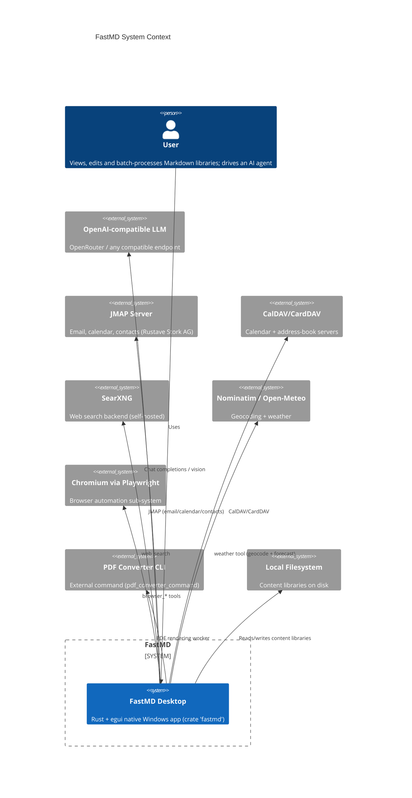
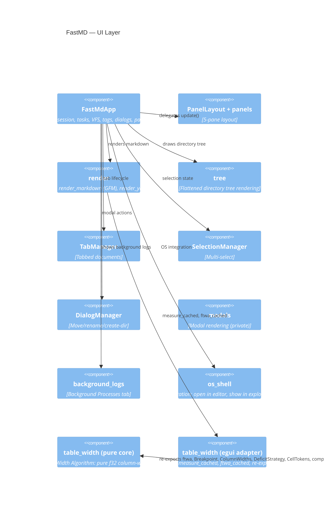
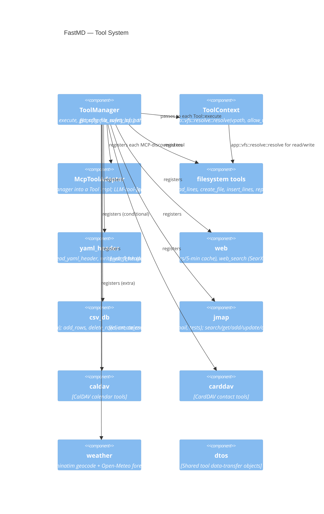
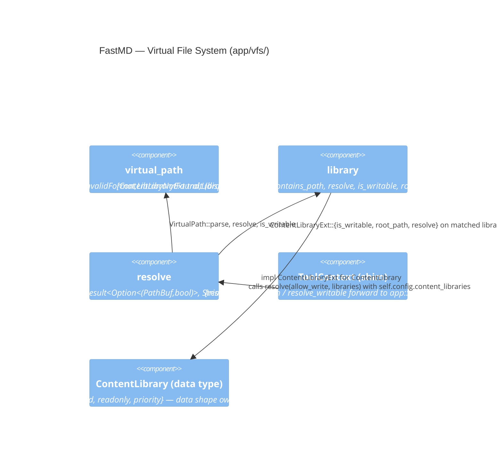
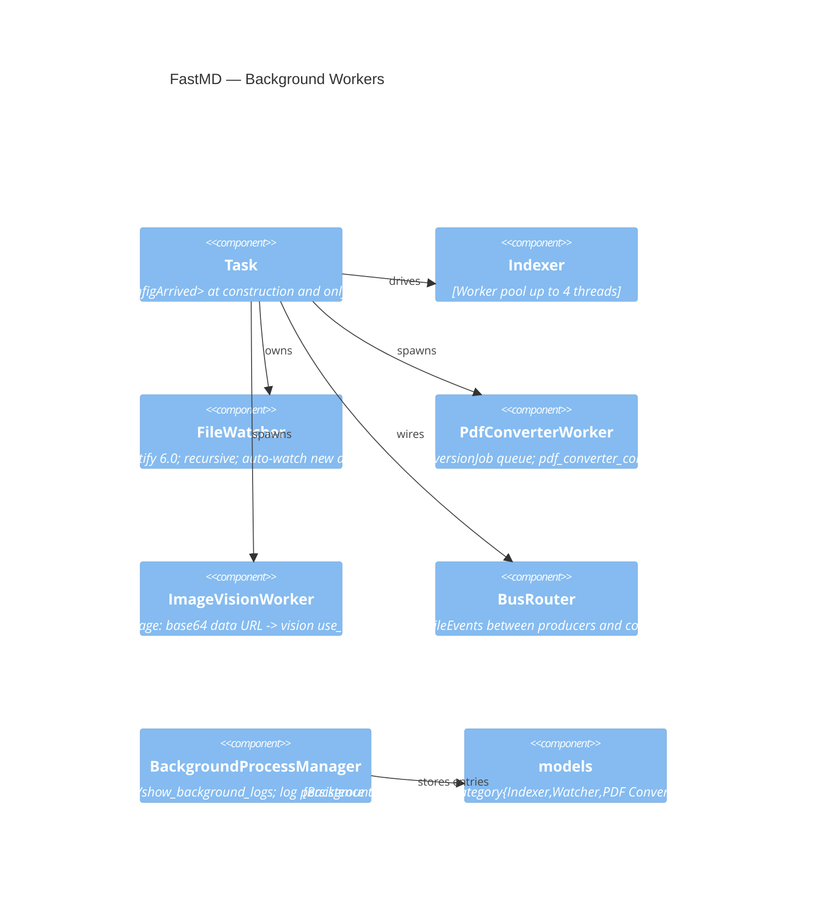
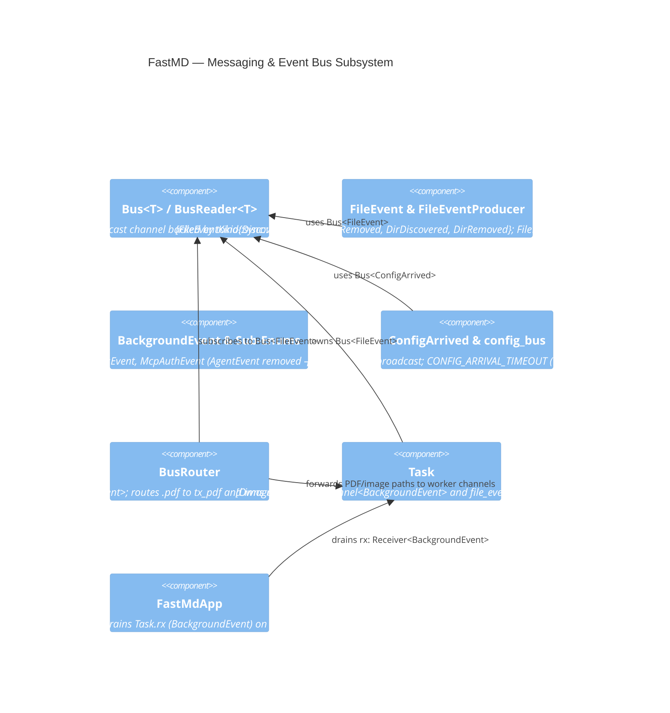
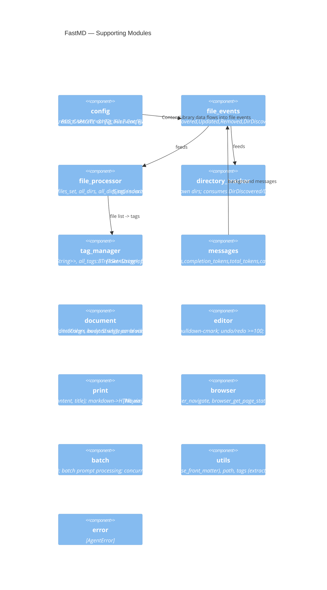

# FastMD C4 Architecture Diagram

## Context Diagram (Level 1)


## Container Diagram (Level 2)

The `fastmd` crate produces a single desktop application

## Component Diagram (Level 3) — UI Layer

`ui/` renders the desktop app. `FastMdApp` (`app.rs`, 1346 lines) is the root
`eframe::App` and owns all cross-cutting state. A 5-pane layout is enforced by
`PanelLayout` driving per-pane render functions in `ui/panels/*`.



Supporting UI types: `TreeNode{name,path,is_dir,children:BTreeMap}`,
`ToCEntry{title,level,id}`, `PersistedUiState{left_panel_width,collapsed_dirs}`.

## Component Diagram (Level 3) — Agent Core

`agent/` implements the LLM tool-loop. A single long-lived driver thread
(spawned by `AgentSessionManager`) owns a `Receiver<AgentPrompt>` and blocks
on `recv()`. On each prompt, it builds a per-session `AgentContext` and runs
`run_agent` directly inline (no double-spawn). The agent publishes
`AgentEvent`s on a `Bus<AgentEvent>` (tokio broadcast); the UI subscribes
and drains per frame.

> **Agent↔UI Seam (feature 003, complete)**: `agent/events.rs` defines the
> structured seam types — `AgentPrompt` (UI→agent mpsc input, carries
> `session_id: Uuid` + `cancel_flag: Arc<AtomicBool>`), `AgentEvent`
> (agent→UI `Bus<AgentEvent>` broadcast output, 11 session-tagged variants),
> `AgentStatus` (typed status), `ToolSideEffect` (file-creation side effect),
> `DelegateToolCall` (structured web-delegate trace). The old
> `BackgroundEvent::Agent(LegacyAgentEvent)` variant and the
> `tx_gui: Sender<BackgroundEvent>` path have been removed. UI formatting
> lives in `ui/render/agent_render.rs`; the agent has zero `ui::render` imports.

```mermaid
C4Component
  title FastMD — Agent Core

  Component(mgr, "AgentSessionManager", "AgentState{running,status,thinking,response,history,token_usage,total_usage,debug_entries}; owns prompt_tx (UI→agent mpsc) + event_bus (agent→UI Bus); driver_handle: JoinHandle; current_session_id: Uuid"")
  Component(impl, "run_agent / run_agent_inner", "Resolves LLM client, builds messages, get_tools_schema, ToolExecutor::new, turn loop; called inline by the driver (no double-spawn)")
  Component(ctx, "AgentContext", "config, prompt, history, active_file, active_dir, selected_files, cancel_flag, session_id: Uuid, agent_event_bus, file_event_bus; no tx_gui, no current_response, no session_number")
  Component(ev, "events", "AgentPrompt (UI→agent mpsc, carries cancel_flag), AgentEvent (agent→UI Bus, 11 session-tagged variants), AgentStatus, ToolSideEffect, DelegateToolCall — the agent↔UI seam types")
  Component(llm, "LLMClient", "parse_usage_block; OpenAI-compatible HTTP")
  Component(pb, "SystemPromptBuilder", "with_active_file/dir/selected_files; USER.md injection per library")
  Component(te, "ToolExecutor", "returns (results, Vec<ToolSideEffect>); safe tools parallel / unsafe tools sequential")

  Rel(mgr, impl, "submit_prompt -> run_agent")
  Rel(impl, ctx, "builds per-session context")
  Rel(impl, ev, "publishes AgentEvent on Bus<AgentEvent>")
  Rel(mgr, ev, "owns event_bus: Bus<AgentEvent>")
  Rel(impl, llm, "chat completions")
  Rel(impl, pb, "system prompt")
  Rel(impl, te, "dispatch tools")
```

## Component Diagram (Level 3) — Tool System

`tools/` defines the `Tool` trait and a `ToolManager` (formerly
`ToolRegistry`) that owns the catalog of built-in and MCP-discovered
tools, the per-group enable/parallel-safe/error state, and the
[`McpClientManager`](../../src/desktop/src/integrations/mcp/manager.rs). `ToolContext<'a>` is the single
parameter passed to every `Tool::execute`, carrying `&AppConfig` and
`&Bus<FileEvent>`.





Tool inventory (matches `Tools.md` + conditional tools):
- **Core Workspace (11):** `grep`, `read_tags`, `list_files_by_tag`,
  `list_files`, `read_file`, `read_lines`, `create_file`,
  `insert_lines`, `replace_text`, `read_yaml_header`,
  `write_yaml_header`.
- **Web Integration (3):** `web_fetch`, `web_search`, `web_delegate`.
- **JMAP Productivity (11):** `search_calendar`, `get_calendar`,
  `get_calendar_item`, `add_calendar_item`, `update_calendar_item`,
  `delete_calendar_item`, `search_email`, `get_email_by_id`, `send_email`,
  `search_contact`, `get_contact`, `add_contact`.
- **Conditional / extra (6):** `add_rows`, `delete_rows`, `create_csv`,
  `list_csv`, `query` (CSV DB, prompt-keyword gated),
  `weather` (not in SPEC tool table).

> `tools/Spotify.md` is a **proposal** for 25+ `spotify_*` tools via OAuth2
> PKCE; not implemented.

## Component Diagram (Level 3) — Background Workers

`background/` hosts long-running workers, coordinated by `background_task::Task`
which owns the `mpsc` channels and the `notify::RecommendedWatcher`. A
`Bus<FileEvent>` (see Event Bus below) feeds producers and consumers.



## Component Diagram (Level 3) — Messaging Architecture (`bus/`)

The `bus/` subsystem provides explicit, type-safe event transportation across thread
boundaries in `fastmd`. All cross-thread updates (file modifications, background indexing
progress, agent turn streaming, worker log entries, MCP authentication) flow through either
multi-producer/multi-consumer broadcast buses (`Bus<T>`) or domain-specific typed `mpsc` channels.



### Overview & Design Principles

1. **Explicit Thread Communication**: Shared mutable state across thread boundaries is strictly avoided. Subsystems communicate exclusively via event channels.
2. **MPMC Broadcast vs MPSC Channels**:
   - **Multi-Producer Multi-Consumer (`Bus<T>`)**: Used when multiple consumers must independently observe the same event (e.g., file changes observed by Indexer, DirectoryTracker, FileEventProcessor, and BusRouter).
   - **Multi-Producer Single-Consumer (`mpsc::channel`)**: Used when events target a single aggregator (e.g., UI frame loop draining `BackgroundEvent` or worker task queues).
3. **Non-Blocking UI Integration**: `BusReader` provides non-blocking `try_recv()` and `recv_timeout()` methods wrapped in a `Mutex`, allowing the single-threaded `egui` UI loop to poll events without stalling rendering.

### Message Types & Payloads

- **`FileEvent`** (`bus/events/file.rs`): Published whenever content libraries change on disk or in memory.
  - Variants (`FileEventKind`): `Discovered`, `Updated`, `Removed`, `DirDiscovered`, `DirRemoved`.
  - Content: `paths: Vec<PathBuf>`.
  - Helpers: `FileEventProducer` simplifies publishing single or batch file/dir operations, including rename semantics (`Removed` + `Discovered`).
- **`BackgroundEvent`** (`bus/events/typed.rs`): Top-level enum carrying domain-specific asynchronous updates to the UI loop:
  - **`FsEvent`**: `FileParsed { path, tags }`, `DirParsed { path }`, `FileModified { path, tags }`, `FileDeleted { path }`, `Finished`, `FinishedWithoutWatcher`.
  - **`ProcessEvent`**: `LogEntry(BackgroundLogEntry)`, `FileLoaded { path, content }`.
  - **`McpAuthEvent`**: `Completed { server_name, error }`.
- **`AgentEvent`** (`agent/events.rs`): Agent→UI `Bus<AgentEvent>` broadcast (tokio, capacity 8192). 11 session-tagged variants: `SessionStarted`, `SessionFinished{history}`, `Status(status: AgentStatus)`, `Thinking`, `ContentDelta`, `ToolCallStarted{id,name,args}`, `ToolResult{id,name,result}`, `ToolSideEffect`, `DebugEntry`, `TokenUsage`, `Failed`. Every variant carries `session_id: Uuid`.
- **`AgentPrompt`** (`agent/events.rs`): UI→agent mpsc input carrying `session_id`, `text`, `active_file/dir`, `selected_files`, `cancel_flag: Arc<AtomicBool>`. The long-lived driver thread blocks on `recv()`.
- **`ConfigArrived`** (`bus/events/config.rs`): Published once at startup carrying `config: AppConfig`. Enables lazy component initialization and prevents race conditions during startup.
- **`TokenUsageInfo`** (`bus/events/messages.rs`): Detailed LLM token consumption metrics (`prompt_tokens`, `completion_tokens`, `total_tokens`, `cached_tokens`, `reasoning_tokens`).

### Event Routing & Dispatch

1. **`BusRouter` (`bus/router/bus_router.rs`)**:
   - Subscribes to `Bus<FileEvent>`.
   - Filters for `Discovered` and `Updated` events.
   - Inspects file extensions:
     - `.pdf` paths -> forwarded to `tx_pdf: Sender<PathBuf>` (`PdfConverterWorker`).
     - Image paths (`.jpg`, `.jpeg`, `.png`, `.gif`, `.webp`, `.bmp`, `.tiff`, `.avif`) -> forwarded to `tx_img: Sender<PathBuf>` (`ImageVisionWorker`).
2. **UI Frame Drain (`ui/app/update.rs`)**:
   - `drain_background_channel()`: Drains `BackgroundEvent` (Fs/Process/McpAuth) from the old mpsc path; dispatches to `FileEventProcessor`, `TagManager`, `BackgroundProcessManager`, tools dialog.
   - `drain_agent_event_bus()`: Drains `BusReader<AgentEvent>` per frame; routes lifecycle events (`SessionStarted`/`SessionFinished`/`Status`/`Failed`/`TokenUsage`/`DebugEntry`) to `AgentSessionManager`; routes content events (`ContentDelta`/`Thinking`/`ToolCallStarted`/`ToolResult`) to `AgentTranscript` in `ui/agent/transcript.rs`; reissues `ToolSideEffect` as `FsEvent::FileModified`.
   - UI widget state lives in `AgentPanelState` (`ui/agent/panel_state.rs`): `show_results`, `show_debug_window`, `debug_search_text`, `debug_auto_scroll`, `command_input`, `scroll_to_id`, `active_session_id`.

### Messaging Actors & Recipients Summary

| Channel / Bus | Transport Primitive | Payload Type | Producers (Actors) | Consumers (Recipients) |
|---|---|---|---|---|
| `Bus<FileEvent>` | `tokio::sync::broadcast` (8192 cap) via `Bus<T>` | `FileEvent` | `FileWatcher`, `Indexer`, UI Dialogs (`FileEventProducer`), Tool Executors | `DirectoryTracker`, `FileEventProcessor`, `Indexer`, `BusRouter` |
| `BackgroundEvent` | `std::sync::mpsc::channel` | `BackgroundEvent` (`Fs`, `Process`, `McpAuth`) | Agent Thread, Indexer Pool, `PdfConverterWorker`, `ImageVisionWorker`, MCP Auth Flow | `FastMdApp` (UI thread loop) |
| `Bus<ConfigArrived>` | `tokio::sync::broadcast` (8192 cap) via `Bus<T>` | `ConfigArrived` | `main()` | `Task`, `AgentSessionManager`, `FastMdApp` |
| `Bus<AgentEvent>` | `tokio::sync::broadcast` (8192 cap) via `Bus<T>` | `AgentEvent` (11 variants) | Agent driver thread (`run_agent`) | `FastMdApp` (UI frame drain → `AgentTranscript` + `AgentSessionManager`) |
| `AgentPrompt` | `std::sync::mpsc::channel` | `AgentPrompt { session_id, text, cancel_flag, ... }` | `AgentSessionManager::submit_prompt` (UI → agent) | Agent driver thread (`recv()` loop) |
| PDF Worker Queue | `std::sync::mpsc::channel` | `PathBuf` | `BusRouter` (for `.pdf` files) | `PdfConverterWorker` |
| Image Vision Queue | `std::sync::mpsc::channel` | `PathBuf` | `BusRouter` (for image files) | `ImageVisionWorker` |
| Agent Cancel | `std::sync::atomic::AtomicBool` | `bool` | `AgentSessionManager` (UI Stop button) | `run_agent_inner` turn loop |

## Component Diagram (Level 3) — Supporting Modules

Cross-cutting modules that the UI, Agent, Tools and Background all depend on.



## Test Surface

- **Integration tests** (`src/desktop/tests/`): background manager, discovery,
  document, editor, log persistence, PDF converter, pulldown config, table
  layout.
- **Inline `#[cfg(test)]` modules:** `agent/agent_impl_tests.rs`,
  `tools/jmap/tests.rs`, `bus/core.rs`, `bus/events/file.rs`, `bus/events/typed.rs`, `bus/config.rs`, `bus/router/bus_router.rs`.
- **UI tests:** `egui_kittest` 0.35 (eframe + snapshot) harnesses following the
  egui `__run_test_ctx` / `State::test_ctx` pattern. Dev-deps also include
  `accesskit 0.24`, `proptest`, `filetime`, `tempfile`, `tokio`.

