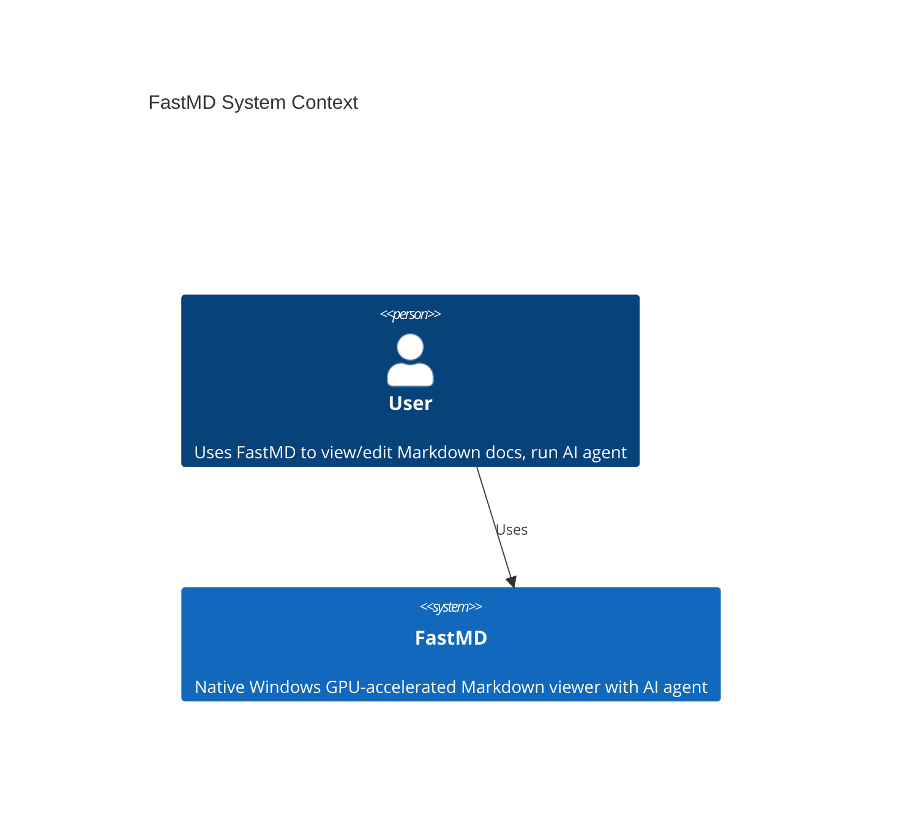

# FastMD C4 Architecture Diagram

## Context Diagram (Level 1)



## Container Diagram (Level 2)

```mermaid
C4Container fastmd
  title FastMD Container Diagram
  
  Component(ui, "UI Layer", "Rust/egui", "4-pane interface with panels, modals, dialogs")
  Component(agent, "Agent Core", "Rust", "LLM orchestration, tool execution loop")
  Component(tools, "Tool System", "Rust", "27+ tools for filesystem, web, calendar, email, CSV")
  Component(background, "Background Workers", "Rust/Tokio", "File indexing, PDF conversion, image vision, file watcher")
  Component(vfs, "Virtual File System", "Rust", "Multi-library path abstraction with priority")
  Component(config, "Configuration", "YAML/Serde", "Models, libraries, API keys, feature flags")
  Component(events, "Event Bus", "mpsc channels", "FileEvent propagation between producers/consumers")
  
  Rel(ui, agent, "starts sessions, displays responses")
  Rel(ui, tools, "indirect via agent")
  Rel(ui, background, "receives logs")
  Rel(ui, vfs, "resolves paths for display")
  Rel(agent, tools, "executes")
  Rel(agent, vfs, "resolves virtual paths")
  Rel(background, vfs, "scans libraries")
  Rel(background, events, "publishes")
  Rel(vfs, config, "reads library definitions")
  Rel(events, ui, "delivers file changes")
  Rel(events, agent, "triggers lazy operations")
```

## Target Refactoring Structure

```
FastMD Application
├── UI Layer (FastMdApp - simplified)
│   ├── Left Panel Controller
│   ├── Center Panel Controller
│   ├── Right Panel Controller
│   ├── Bottom Panel Controller
│   └── Modal/Dialog Controllers
├── Agent Core
│   ├── AgentSessionManager
│   ├── LLMClient
│   ├── ToolExecutor
│   ├── SystemPromptBuilder
│   └── ResponseFormatter
├── Tool System
│   ├── ToolRegistry (holds Box<dyn Tool>)
│   ├── ToolContext (config, bus, path resolution)
│   ├── Filesystem Tools (grep, read, write, etc.)
│   ├── Web Tools (fetch, search, delegate)
│   ├── Calendar Tools (CalDAV)
│   ├── Email/Contact Tools (JMAP/CardDAV)
│   └── CSV Database Tools
├── Background Workers
│   ├── Indexer (worker pool + queue)
│   ├── PdfConverterWorker
│   ├── ImageVisionWorker
│   ├── FileWatcher
│   └── FileEventBusRouter
├── Virtual File System
│   ├── VirtualPath (parser, resolver)
│   ├── ContentLibrary (with methods)
│   └── LibraryRegistry
├── Configuration
│   ├── AppConfig (data-only)
│   ├── ConfigLoader
│   └── ConfigValidator
└── Event Bus
    ├── Bus<FileEvent> (multi-producer/multi-consumer)
    ├── FileEventProducer
    └── FileEventKind (Discovered/Updated/Removed)
```

---

## Key Improvements

1. **FastMdApp** reduced from 1177 lines to ~100 lines (extracted 6 managers)
2. **Agent** reduced from 863 lines to ~150 lines (extracted LLM client, tool executor)
3. **Tool registry** simplified (5-param → 1-param ToolContext)
4. **Background** split into 5 focused components (<200 lines each)
5. **Virtual FS** becomes deep abstraction (VirtualPath hides encoding)
6. **Configuration** remains thin (data-only)

All components respect:
- PSD-001: Deep modules (interface << implementation)
- PSD-002: Methods ≤ 4 parameters
- PSD-003: No information leakage
- PSD-005: No entangled methods
- PSD-008: High-level simplicity
